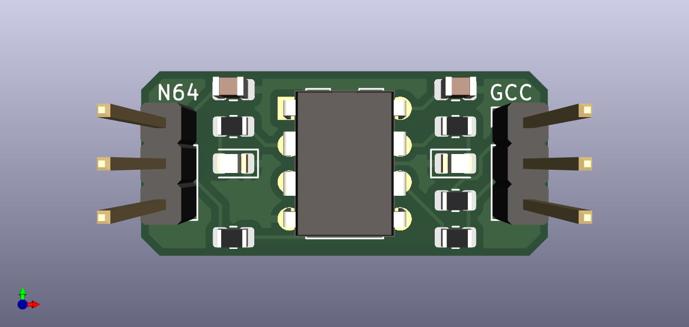
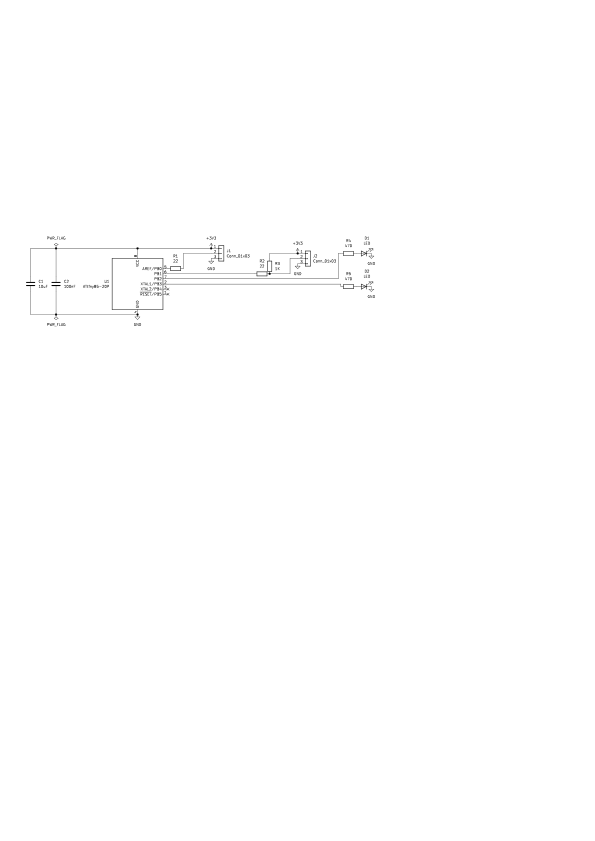

# gc2n64
Gamecube controller to N64 adapter. Dependencies:

 * [avra](https://github.com/Ro5bert/avra): `apt install avra` - AVR assembler
 * [avrdude](https://github.com/avrdudes/avrdude): `apt install avrdude` - to flash program to ATTiny
 * [KiCAD](https://www.kicad.org/): `apt install kicad` - for schematic
 * [ATTiny25/45/85](https://www.microchip.com/en-us/product/attiny25): - 8-pin DIP is used for running the code

Usage:

```
# Build
make

# Flash to attiny25/45/85
make flash

# Delete build output
make clean
```

The KiCAD schematic is in the schematic directory. An 8-PDIP socket can be used in the PCB so that an existing ATTiny can be plugged in, that can be (re-)flashed separately using a USB programmer. The pin headers can also be left off so that the wires can be soldered directly to sacrificial extension cables for N64 and Gamecube controllers. Those 2 changes also make the PCB cheaper (no microcontroller, no headers). The program is written in assembly to do cycle-accurate bit-banging for converting the gamecube controller serial protocol to n64 serial protocol.




